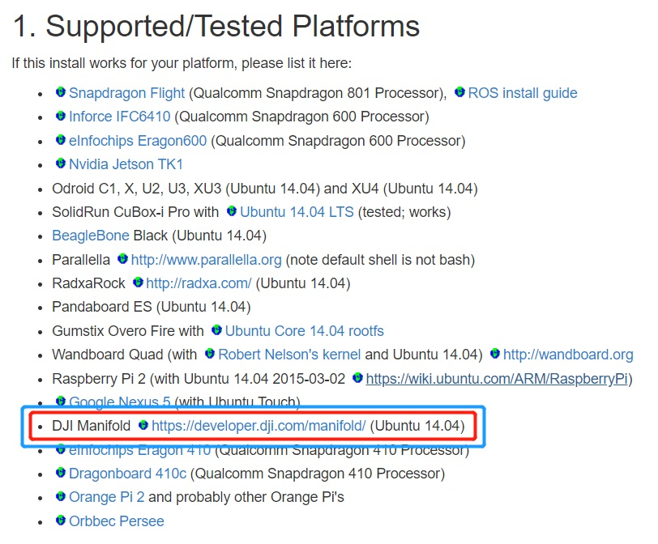

# Manifold配置ROS开发环境（妙算试坑笔记）

妙算[Manifold](https://www.dji.com/cn/manifold)是大疆无人机上的机载miniPC，其中的核心板是NVIDIA的嵌入式视觉板Jetson Tegra K1。不过于2019年已经停产。由于安装妙算过程中试过很多坑，所以笔者在此记录一下安装和配环境的过程。


## 0. 系统重装
### 制作系统前需要准备:

- 系统镜像（可以使用[DJI官网上的镜像](https://dl.djicdn.com/downloads/manifold/manifold_image_v1.0.tar.gz)）；
- Ubuntu 14.04 的计算机一台（可以用虚拟机但是笔者试了有些慢不推荐）。
PS：一定是14.04的系统，笔者用过16.04的来制作会产生显示闪烁的问题。一定是14.04!一定是14.04!一定是14.04!重要的事情说三遍。

### 解压安装包 
 在终端下输入如下命令：

```shell
mkdir  ~/manifold
cd ~/manifold
sudo tar -xvpzf  <path>/manifold_image_v1.0.tar.gz
```

### 妙算进入恢复模式
参考[使用手册](https://dl.djicdn.com/downloads/manifold/20170918/Manifold_User_Manual_v1.2_CH.pdf),笔者使用的方法：
- 连接妙算和计算机 (Manifold)micro-B <-> USB(PC);
- 连接电源;
- 按住recover键不松开，再按下电源键，释放电源键后松开recover键。

在终端中输入
```shell
lsusb
```
若出现信息中包含有如下所示的项则进入回复模式成功，否则重复以上步骤。
```text
Bus 001 Device 008: ID 0955:7740 Nvidia Corp.
```
### 制作系统镜像
同样参考[使用手册](https://dl.djicdn.com/downloads/manifold/20170918/Manifold_User_Manual_v1.2_CH.pdf)：

在终端输入以下指令：
```shell
cd ~/manifold/Linux_for_Tegra/bootloader
sudo ./nvflash --read APP system.img --bl ardbeg/fastboot.bin --go
```
完成后需要等待15~30min。
在此要注意的是：手册上给的路径\manifold_images需要改成\Linux_for_Tegra；-go改成--go。

### 恢复系统镜像
还是参考[使用手册](https://dl.djicdn.com/downloads/manifold/20170918/Manifold_User_Manual_v1.2_CH.pdf)：
在终端输入以下指令：
```shell
cd ~/manifold/Linux_for_Tegra
sudo ./flash.sh –r jetson-tk1 mmcblk0p
```
此过程等待15~20min。

---
## 1. 安装CUDA
参考[使用手册](https://dl.djicdn.com/downloads/manifold/20170918/Manifold_User_Manual_v1.2_CH.pdf)。
- 在[此处](https://developer.download.nvidia.cn/embedded/L4T/r21_Release_v3.0/cuda-repo-l4t-r21.3-6-5-prod_6.5-42_armhf.deb)下载CUDA安装文件;
- 在终端输入以下指令进行安装：(大约需要10~15min)
```shell
cd <path>
sudo dpkg -i cuda-repo-l4t-r21.3-6-5-prod_6.5-42_armhf.deb 
sudo apt-get update 
sudo apt-get install cuda-toolkit-6-5
```
---
## 2. 安装OpenCV4tegra
参考[使用手册](https://dl.djicdn.com/downloads/manifold/20170918/Manifold_User_Manual_v1.2_CH.pdf)。

- 在[此处](https://developer.download.nvidia.cn/embedded/L4T/r21_Release_v3.0/cuda-repo-l4t-r21.3-6-5-prod_6.5-42_armhf.deb)下载安装文件，手册上的[地址](http://developer.download.nvidia.com/embedded/OpenCV/L4T_21.2/libopencv4tegra-repo_l4t-21_2.4.10.1_armhf.deb)，笔者试了404 Not Found;
- 在终端输入以下指令进行安装：(大约需要10~15min)
```shell
cd <path>
sudo dpkg -i cuda-repo-l4t-r21.3-6-5-prod_6.5-42_armhf.deb 
sudo apt-get update 
sudo apt-get install cuda-toolkit-6-5
```
---
## 3. 安装ROS(UbuntuARM平台版本)
参考[ROSwiki](http://wiki.ros.org/indigo/Installation/UbuntuARM)，可以看到，它是支持Manifold平台的，所以要相信能安装成功, 如果不行那就重头再来一次[手动捂脸]。


首先进行区域设置
```shell
sudo update-locale LANG = C LANGUAGE = C LC_ALL = C LC_MESSAGES = POSIX
```
添加源和密钥，这里和参考的不一样，因为之前出现过漏洞的原因，所以密钥被换过（不要问笔者为什么知道的[手动捂脸]）。
```shell
sudo sh -c 'echo "deb http://packages.ros.org/ros/ubuntu trusty main" > /etc/apt/sources.list.d/ros-latest.list'
sudo -E apt-key adv --keyserver 'hkp://keyserver.ubuntu.com:80' --recv-key C1CF6E31E6BADE8868B172B4F42ED6FBAB17C654
sudo apt-get update
```
如果之前添加了旧的密钥，按照如下指令操作：
```shell
sudo apt-key del B01FA116
sudo -E apt-key adv --keyserver 'hkp://keyserver.ubuntu.com:80' --recv-key C1CF6E31E6BADE8868B172B4F42ED6FBAB17C654
sudo apt-get update
```
输入如下指令安装ROS：(此处等待过程非常漫长，建议睡觉前开始[手动捂脸])
```shell
sudo apt-get install ros-indigo-ros-base
sudo apt-get install ros-indigo-desktop
```
初始化rosdep
```shell
sudo apt-get install python-rosdep
sudo rosdep init
rosdep update
```
设置环境
```shell
echo "source /opt/ros/indigo/setup.bash" >> ~/.bashrc
source ~/.bashrc
```